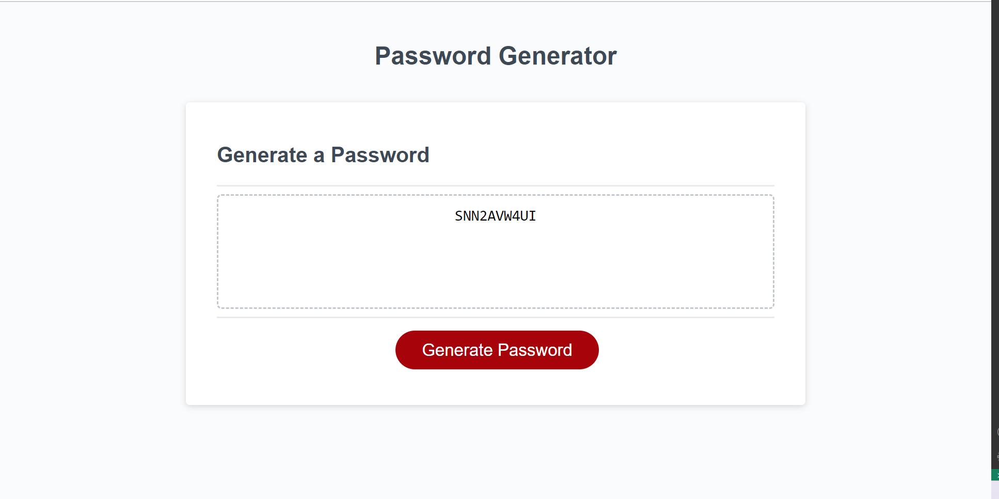

# Password Generator Starter Code

## Description

I completed a password generator so that anyone could utilize the site to retreive a randomized password. This site solves the issue of what password one should utilize; simply click the generate password button to retreive a random password. I learned a lot in this project. Initially I thought to use functions for the random characters, but it was explained to me that a function would only output one character, whereas an array could output various characters. I learned how to use a for-loop, and practiced if-else conditions. Lastly, I learned how to use confirmation windows, and prompt windows. 

## Installation

One can download the code from my project by going to GitHub, and selecting the green copy button and save the HTTPS to the clipboard. Use the git clone command in GitBash and open Visual Studio by typing "code .". 

## Usage

Use the password generator by going to the site, and simply click generate password. Once the generate password button is selected, various confirmation windows will appear asking if the user would like uppercase, lowercase, numbers, and/or symbols. The last prompt asks for the desired length of the password, where you input a number. Below is the result received after all the prompts have been completed.


    ```

## Credits

I used assistance from the tutor, Andres, at UNCC. I found the below resources for further explainations on EventListeners, confirmations, prompts.

EventListener - https://www.w3schools.com/js/js_htmldom_eventlistener.asp

Confirmations - https://www.w3schools.com/jsref/met_win_confirm.asp

Prompts - https://www.w3schools.com/js/js_popup.asp


